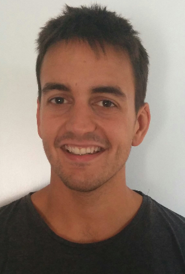

<!--  -->

## Gonzalo Mateo García

### Current position: PhD student

### <a href="http://isp.uv.es" target="blank">Image and signal processing group (ISP)</a>

### <a href="http://ipl.uv.es" target="blank">Image processing laboratory (IPL)</a>

I'm currently a PhD student in the Image processing laboratory at Universidad de Valencia.

My research interests are in the field of machine learning with applications on multispectral satellite images. I worked under the <a href="https://research.google.com/research-outreach.html#/research-outreach/faculty-engagement/earth-engine-research-awards" target="blank">Google Earth Engine Award</a> project to develop machine learning cloud detection algorithms (<a href="http://isp.uv.es/projects/cdc/GEE_cloud_detection_results.html" target="blank">some results</a>). Currently I have focused on convolutional neural networks and deep learning.

This is my <a href="statement.pdf" target="blank">research statement</a>. Please feel free to contact me at:  
 gonzalo.mateo-garcia **AT** <a href="http://www.uv.es" target="blank">uv</a> DOT es.

### Publications

1. **Cloud masking and removal in remote sensing image time series**   
  Gómez-Chova, Luis and Amorós-López, Julia and Mateo-García, Gonzalo and Muñoz-Marí, Jordi and Camps-Valls, Gustau	  
  Journal of Applied Remote Sensing 11 (1) :015005, 2017   
  <a href="http://dx.doi.org/10.1117/1.JRS.11.015005" target="blank"> DOI url </a>

2. **Cloud detection machine learning algorithms for PROBA-V**  
  Gomez-Chova, Luis and Mateo-Garcia, Gonzalo and Muñoz Mari, Jordi and Camps-Valls, Gustau  
  Work in progress

3. **Convolutional neural networks for multispectral image cloud masking**  
  Mateo-Garcia, Gonzalo and Gomez-Chova, Luis and Camps-Valls, Gustau  
  Work in progress

3. **Optimizing Basis Functions in Kernel Ridge Regression**  
  Mateo-Garcia, Gonzalo and Laparra, Valero and Muñoz-Marí, Jordi and Gómez-Chova, Luis  
  Work in progress

 
