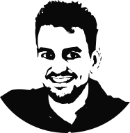

<!--  -->

## Gonzalo Mateo García

### PhD student

### <a href="http://isp.uv.es" target="_blank">Image and signal processing group (ISP)</a>

### <a href="http://ipl.uv.es" target="_blank">Image processing laboratory (IPL)</a>

I'm a PhD student in Image and Signal Processing Group in the Image Processing Laboratory Institute at Universidad de Valencia. My advisor is <a href="http://www.uv.es/chovago/" target="_blank">Prof. Luis Gómez-Chova</a>.

My research interests are in the field of applied machine learning. I am specially interested in applications to natural sciences like Earth observation, remote sensing and weather and energy forecasting. In 2019 I participated in the <a href="https://fdleurope.org/" target="_blank">Frontier Development Lab 2019 Europe</a> research sprint in the <a href="https://fdleurope.org/all/2019/8/14/fdl-europe-2019-disaster-prevention-progress-amp-response-floods-team" target="_blank"> Disaster Prevention, Progress and Response team</a> working on <a href="https://arxiv.org/abs/1910.03019" target="_blank">Onboard Flood Segmentation</a>. During 2017 I worked under a <a href="https://research.google.com/research-outreach.html#/research-outreach/faculty-engagement/earth-engine-research-awards" target="_blank">Google Earth Engine Award</a> project developing machine learning cloud detection algorithms (<a href="https://isp.uv.es/projects/cdc/viewer_l8_GEE.html" target="_blank">some results</a>). Previously I worked in renewable energy forecasting at [MeteoLogica](http://meteologica.com){:target="_blank"}.

My research involves convolutional neural networks for semantic segmentation, transfer learning and uncertainty estimation in deep learning applied to flood and cloud detection.

Please feel free to contact me at:

[gonzalo.mateo-garcia@uv.es](mailto:gonzalo.mateo-garcia@uv.es)
{:style="text-align: center;"}

 
